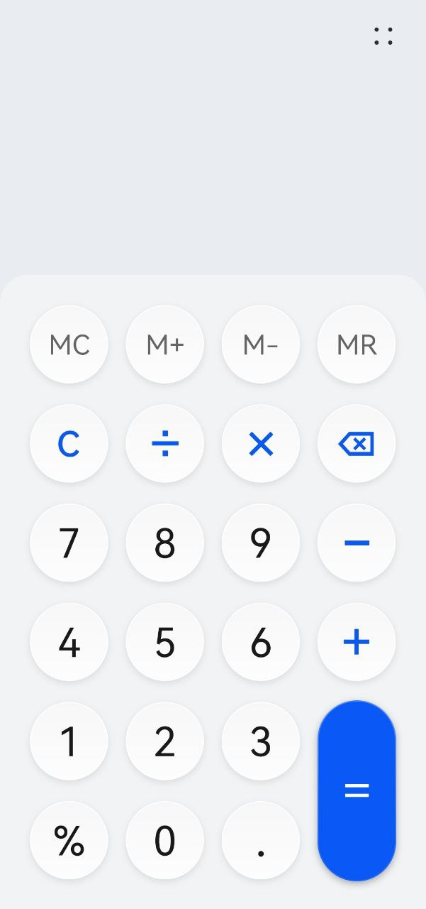
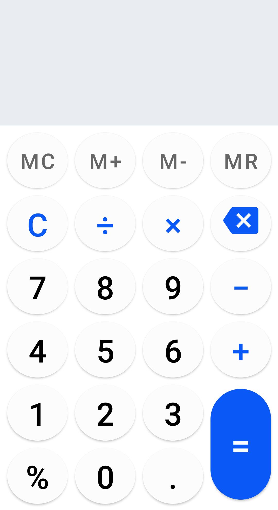

# __Huawei Calculator App Clone__
This Android project is a clone of the Huawei Calculator app, but with no behavior implemented, only the views. The purpose of this project is to demonstrate how to recreate the user interface of the Huawei Calculator app using XML layouts.

## __Getting Started__
To use this project, you will need to have Android Studio installed on your computer. Once you have downloaded the project files, you can open the project in Android Studio and run it on an Android emulator or device.

## __Prerequisites__
- You will need to have Android Studio installed on your computer. You can download it from [here](https://developer.android.com/studio/).
- Android emulator or device

## __Installing__
1) Clone or download the project files.
2) Open the project in Android Studio.
3) Run the project on an Android emulator or device.

## __Code Snippets__
The `activity_main.xml` file contains the XML layout for the clone app. It includes `MaterialButton` for various basic arithmetic operations. This file includes the main calculator screen, which features a large display area for the current calculation and buttons for numeric input and basic mathematical operations.

## __Screenshots__
<!--   -->
<!-- add images side-by-side for comparison, with caption for both-->
| Huawei Calculator | Clone App |
|:---:|:---:|
|  |  |